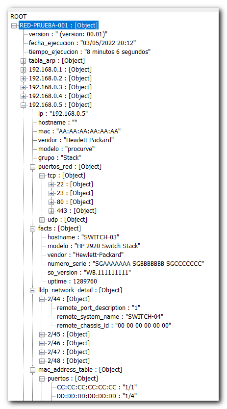
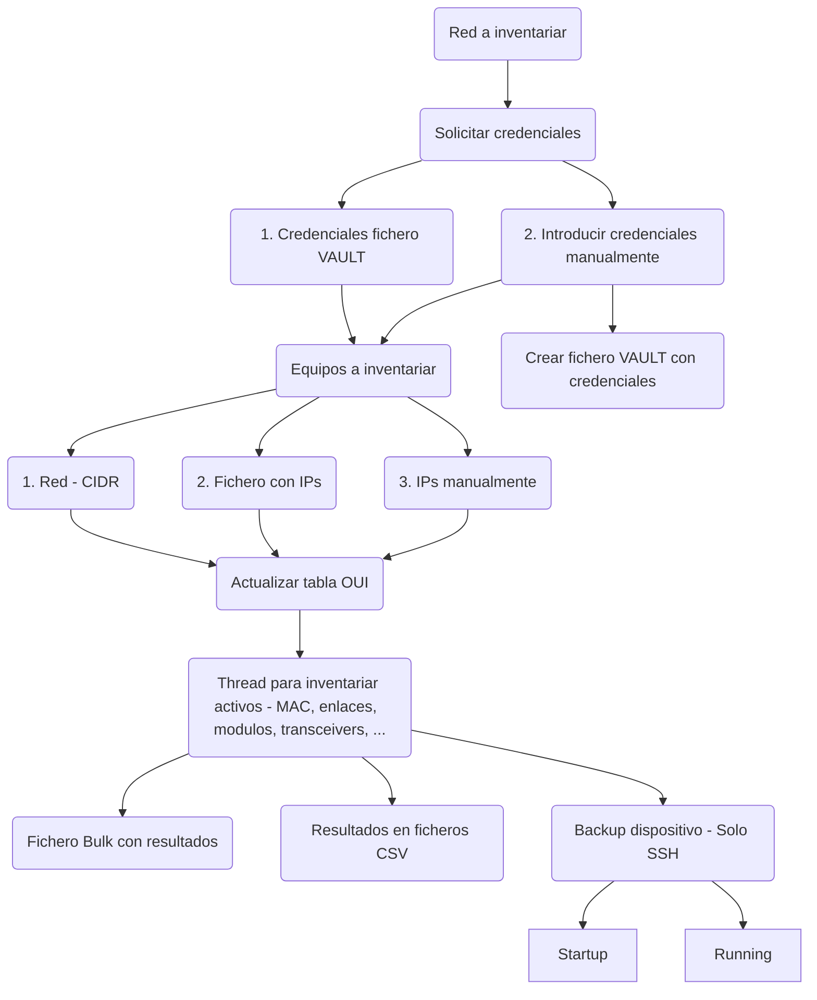

# inventario-lan

Script ```Python``` para automatizar el inventario de dispositivos de red mediante SSH ([**NAPALM**](https://github.com/napalm-automation/napalm)) y [**SNMP**](https://github.com/etingof/pysnmp)

(Script en fase de pruebas finales, pendiente de publicación)

Los resultados se graban en un archivo bulk ```JSON``` (puede ser consultado fácilmente desde ```Notepad++``` con el plugin ```JSON Viewer```)

  
  
y se crean ficheros CSV con el inventario de:

- Switches
- Enlaces
- Tablas Mac
  - Puertos locales
  - Enlaces
- Módulos
- Transceivers

Si la conexión con el dispositivo se realiza mediante SSH (NAPALM) se generan ficheros con la configuración ( ```startup``` / ```running``` ) del dispositivo.

## Credenciales

Las credenciales de acceso pueden ser:

* SSH (```usuario``` ```password```)
* SNMP V1 (```comunidad```)
* SNMP V2 (```comunidad```)
* SNMP V3
  1. ```usuario``` (security name)
  2. ```protocolo autenticación``` ( NOAUTH | MD5 | SHA | SHA-224 | SHA-256 | SHA-384 | SHA-512 )
  3. ```pass phrase``` (authentication protocol)
  4. ```protocolo privacidad``` ( NOAUTH | MD5 | AES-128 | AES-192 | AES-256 )
  5. ```pass phrase``` (privacy protocol)

Las credenciales pueden almacenarse en un fichero Vault ([**Ansible Vault**](https://github.com/ansible-community/ansible-vault)) para facilitar la creación de tareas que realicen el inventario periódicamente mediante crontab, etc.

## Flujo script



## Modo de funcionamiento

El script puede ejecutarse en dos modalidades:

- ```Interactivo```: Todos los datos necesarios para la ejecución del script se solicitan de interactivamente
- ```Comando```: Los parametros de ejecución se solicitan mediante un comando

Al ejecutar el script se utiliza ```nmap``` para descubrir el estado de los puertos habituales de gestión:

   * TCP:
     *  22(ssh)
     *  23(telnet)
     *  80(http)
     *  443(https)
   * UDP: 
     * 161 (snmp)

por lo que **debe estar autorizado para poder realizar este tipo de acciones en la red a inventariar**.

---

### (A) Interactivo

Los datos que debe proporcionar para la ejecución del script son

1. Nombre de la red a inventariar
2. Credenciales
   1. Fichero VAULT con credenciales
   2. Introducir credenciales (SSH, SNMP V1, V2c y V3)
      (Puede crear un fichero VAULT con las credenciales suministradas)
3. Dispositivos a inventariar:
   1. Automático - Rango CIDR (ping sweep)
   2. Fichero con direcciones IP
   3. Añadir direcciones IP
4. ¿Desea actualizar OUI (mac vendor) desde [**IEEE**](http://standards-oui.ieee.org/oui.txt)?

---

### (B) Comando

```inventario_lan.py -h
usage: inventario_lan.py [-h] [--crear_vault] [--nombre_red NOMBRE_RED] [--fichero_ansible_vault FICHERO_ANSIBLE_VAULT | --usuario_ssh USUARIO_SSH]
                         [--vault_password VAULT_PASSWORD] [--password_ssh PASSWORD_SSH] [--red_cidr RED_CIDR | --fichero_ip FICHERO_IP | --dir_ip DIR_IP]
                         [--macvendor] [--verbose]

Inventario de dispositivos LAN

optional arguments:
  -h, --help            show this help message and exit
  --crear_vault         Crear vault para almacenar y proteger credenciales
                        
  --nombre_red NOMBRE_RED
                        nombre de red
                        
  --fichero_ansible_vault FICHERO_ANSIBLE_VAULT
                        (Credenciales) Fichero VAULT con contraseñas
  --usuario_ssh USUARIO_SSH
                        (Credenciales) Usuario (ssh)
                        
  --vault_password VAULT_PASSWORD
                        Contraseña para el fichero VAULT
                        
  --password_ssh PASSWORD_SSH
                        Palabra de paso (ssh)
                        
  --red_cidr RED_CIDR   (Equipos) Red en fornato CIDR (ejm: 192.168.1.1/24)
  --fichero_ip FICHERO_IP
                        (Equipos) Fichero con direcciones ip (una ip por linea)
  --dir_ip DIR_IP       (Equipos) Direcciones ip (separadas por comas)
                        
  --macvendor           Descargar macvendors (OUI) desde IEEE
                        
  --verbose             Mostrar mensajes durante la ejecucion del script
```
---

## Modificaciones 

 Parches y nuevas funciones

| Driver | Notas | Tipo |
| --- | --- | --- |
| [**napalm-hp-procurve**](https://github.com/fmbrieva/napalm-hp-procurve/commits/master) | Stacking | Patch |
| [**napalm-hp-procurve**](https://github.com/fmbrieva/napalm-hp-procurve/commits/master) | ChassisId truncated | Bug |
| [**napalm-hp-procurve**](https://github.com/fmbrieva/napalm-hp-procurve/commits/master) | get_arp_table() Old firmware | Bug |
| [**napalm-hp-procurve**](https://github.com/fmbrieva/napalm-hp-procurve/commits/master) | get_modules | Nuevo |
| [**napalm-hp-procurve**](https://github.com/fmbrieva/napalm-hp-procurve/commits/master) | get_transceivers | Nuevo |
| [**napalm-flexfabric**](https://github.com/fmbrieva/napalm-flexfabric) | `En curso` |  |


## Créditos
 
- [**NAPALM Automation**](https://github.com/napalm-automation/napalm) Network Automation and Programmability Abstraction Layer with Multivendor support
- [**NAPALM Automation Community**](https://github.com/napalm-automation-community) Comunidad NAPALM Automation
- [**NAPALM HP Procurve**](https://github.com/napalm-automation-community/napalm-hp-procurve) Driver para switches Aruba HP Procurve
- [**NAPALM HPE Flexfabric**](https://github.com/fmbrieva/napalm-flexfabric) Driver para switches HPE Comware (Flexfabric)
- [**Python SNMP**](https://github.com/etingof/pysnmp) SNMP library for Python
- [**Ansible Vault**](https://github.com/ansible-community/ansible-vault) Ansible Vault
